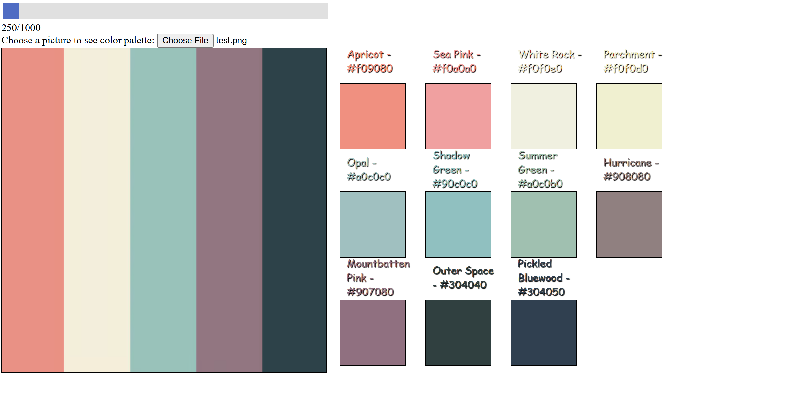
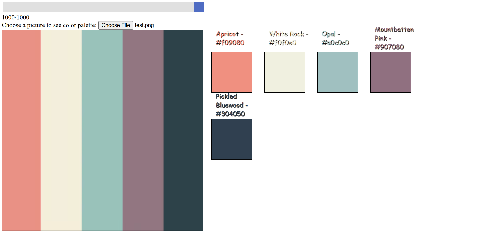

# 🎨 Image Color Extractor

A simple web app that extracts the most prominent colors from an uploaded image and displays their names using [The Color API](https://www.thecolorapi.com/).  

---

## 🚀 Features
- Upload any image and analyze its color palette.  
- Adjustable threshold to filter dominant colors.  
- Fetches color names and details dynamically via API.  
- Clean and responsive UI with live previews.

---

## 🛠️ Tech Stack


---

## 📸 Screenshots

### 🔹 Upload & Analyze
> *Showing output for minimum threshold*



### 🔹 Color Palette Output
>  *Showing output for max threshold*



---

## 📂 Project Structure
```
.
├── index.html        # Main HTML file
├── style.css         # Styling for the app
├── app.js         # Color extraction logic
├── /images      # Placeholder for screenshots + testing image
└── README.md         # Documentation
```

---

## ⚙️ How to Run
1. Clone the repository:
   ```bash
   git clone https://github.com/nhtoi/ImagePalette.git
   ```
2. Open `index.html` in your browser.  
3. Upload an image and adjust the slider to see the extracted colors.

---

## 🤝 Contributing
Feel free to fork this repository and submit pull requests for improvements or bug fixes.
